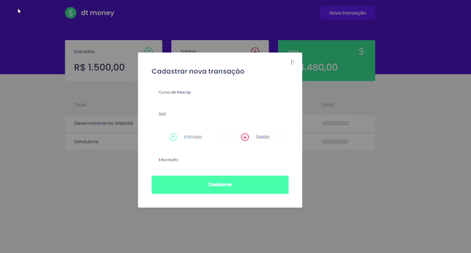

<h1 align="center">
  DtMoney
</h1>

- - -

<h1>Preview</h1>

  

 

## Tecnologias

 Esse projeto foi desenvolvido com as seguintes tecnologias:

- HTML
- STYLED COMPONENTS
- REACT 
- TYPESCRIPT

## Projeto

 Nesse projeto foi criado do zero essa aplicação web que é basicamente uma aplicação para controle financeiro, onde podemos cadastrar novas transações, como depósito e retirada e tudo isso irá ser listado e irá refletir no nosso total que é exibido na interface da aplicação. Estou utilizando React com typescript, e para salvar os dados usamos o Miragejs que basicamente substitui o nosso banco de dados tradicional e pode ser bem útil em algumas ocasiões, todos os estilos dessa página foram feito com Css in Js no caso utilizando a biblioteca Styled Components, e para consumir a API que é criada também para nossas Transações é utilizado o axios, essa aplicação está toda dividida por componentes e utilizando as melhores boas práticas.

 - - - 

 Projeto desenvolvido por Enan Dorta no curso de ReactJS na Rocketseat.